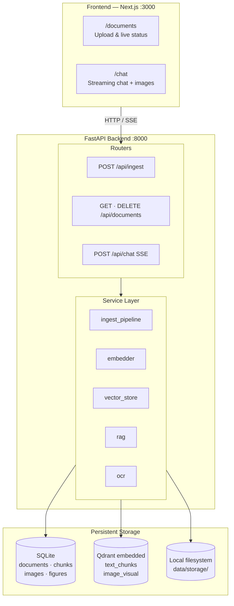
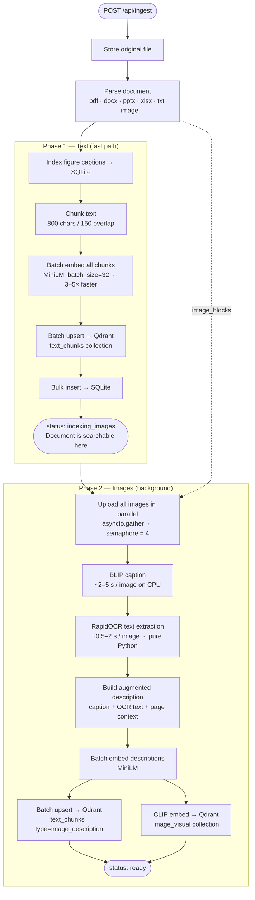
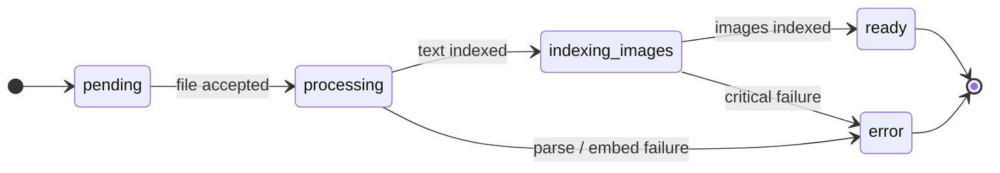
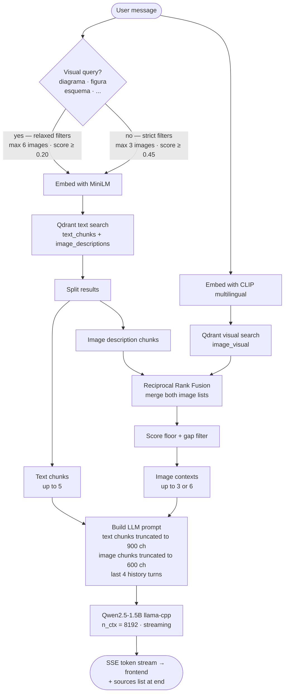

# Documentation Chat — Multimodal RAG for Internal Bank Documents

A multimodal Retrieval-Augmented Generation (RAG) system that lets bank employees query internal documentation (PDFs, Word, PowerPoint, Excel, images) through a conversational interface. All models run **fully local** — no external API calls, no Docker, no GPU required.

---

## Architecture Overview



---

## Backend

### Stack

| Component | Technology |
|-----------|-----------|
| API framework | FastAPI + Uvicorn |
| Async ORM | SQLAlchemy 2.0 + aiosqlite (SQLite) |
| Vector store | Qdrant embedded — no Docker, no server |
| File storage | Local filesystem (`data/storage/`) |
| Streaming | SSE via sse-starlette, tokens bridged via `asyncio.Queue` |
| Runtime | Python 3.11+ |

### Models

All models are public HuggingFace weights, downloaded once on first startup and cached under `backend/models_cache/`. No API token required.

| Role | Model | Size | Speed (CPU) |
|------|-------|------|-------------|
| LLM — chat answers | `bartowski/Qwen2.5-1.5B-Instruct-GGUF` Q4_K_M | ~1 GB | ~10–30 tok/s |
| Text embeddings | `paraphrase-multilingual-MiniLM-L12-v2` | ~500 MB | batch ~50 chunks/s |
| Image captioning | `Salesforce/blip-image-captioning-base` | ~450 MB | ~2–5 s/image |
| Visual embeddings | `openai/clip-vit-base-patch32` | ~600 MB | ~0.5 s/image |
| Text→visual search | `clip-ViT-B-32-multilingual-v1` | ~600 MB | instant |
| OCR | `rapidocr-onnxruntime` (ONNX) | ~10 MB | ~0.5–2 s/image |

**Total first-run download: ~3.1 GB.** Subsequent starts load from cache in ~30–60 s.

---

### Ingestion Pipeline

Ingestion runs in **two phases** so the document is searchable for text queries within seconds, while image processing continues in the background.



#### Document Status Flow



> Deleting a document while ingesting calls `cancel_pipeline(doc_id)`. The pipeline checks this flag between images and aborts cleanly — no zombie processes.

#### Supported Formats

| Format | Parser | Image extraction |
|--------|--------|-----------------|
| PDF | PyMuPDF + pdfplumber | Embedded raster images + vector diagram pages rendered at 150 DPI |
| DOCX | python-docx | Inline images |
| PPTX | python-pptx | Slide images + speaker notes text |
| XLSX | openpyxl | Cell text (tab-separated per sheet) |
| TXT / MD | built-in | — |
| JPG / PNG / WebP | direct | Treated as a single image block |

PDF vector diagram detection: pages with ≥ 15 drawing paths and ≤ 600 chars of prose text are rendered to PNG so BLIP can caption UML diagrams, flowcharts, C4 models, and org charts.

---

### Retrieval & RAG



#### Vector Collections

| Collection | Embedding model | Dims | Contents |
|------------|----------------|------|----------|
| `text_chunks` | MiniLM multilingual | 384 | Text chunks + image description chunks |
| `image_visual` | CLIP ViT-B/32 | 512 | Direct image embeddings for visual similarity |

---

### API Endpoints

| Method | Route | Description |
|--------|-------|-------------|
| `POST` | `/api/ingest` | Upload document (max 200 MB); returns `doc_id` immediately |
| `GET` | `/api/documents` | List documents with pagination |
| `GET` | `/api/documents/{id}` | Document detail with chunks and images |
| `DELETE` | `/api/documents/{id}` | Delete document, vectors, files; cancels in-flight ingestion |
| `GET` | `/api/documents/{id}/status` | Ingestion status polling |
| `GET` | `/api/images/{id}` | Serve a stored image by ID |
| `POST` | `/api/chat` | SSE streaming chat with RAG context |
| `GET` | `/api/health` | Health check for all services and models |

Interactive docs: `http://localhost:8000/docs`

---

### Key Files

```
backend/
├── app/
│   ├── config.py                  # All settings (Pydantic Settings + .env)
│   ├── models.py                  # ORM: Document · Chunk · DocumentImage · DocumentFigure
│   ├── schemas.py                 # Pydantic response schemas
│   ├── database.py                # Async SQLite engine + session factory
│   ├── main.py                    # FastAPI lifespan (model loading at startup)
│   ├── routers/
│   │   ├── ingest.py              # POST /api/ingest
│   │   ├── documents.py           # Document CRUD + image serving
│   │   └── chat.py                # POST /api/chat (SSE)
│   ├── services/
│   │   ├── ingest_pipeline.py     # Two-phase orchestrator + cancellation registry
│   │   ├── embedder.py            # MiniLM batch embed · CLIP embed · BLIP caption
│   │   ├── vector_store.py        # Qdrant single + batch upsert, search, delete
│   │   ├── rag.py                 # Context build · RRF fusion · LLM streaming
│   │   ├── ocr.py                 # RapidOCR ONNX wrapper (lazy singleton)
│   │   ├── chunker.py             # RecursiveCharacterTextSplitter wrapper
│   │   ├── file_storage.py        # Local filesystem abstraction
│   │   └── parsers/
│   │       ├── pdf_parser.py      # PyMuPDF + pdfplumber + vector-diagram detection
│   │       ├── docx_parser.py
│   │       ├── pptx_parser.py
│   │       ├── xlsx_parser.py
│   │       └── image_parser.py
│   └── utils/
│       └── model_manager.py       # Singleton loader: LLM · MiniLM · BLIP · CLIP
├── data/                          # Runtime data — gitignored
│   ├── db.sqlite
│   ├── qdrant/
│   └── storage/
├── models_cache/                  # HuggingFace model cache — gitignored
├── requirements.txt
├── .env
└── start.bat
```

---

### Configuration

All settings have defaults in `config.py`. Override via `backend/.env`:

```env
# Ingestion
MAX_IMAGES_PER_DOC=50        # BLIP ~3 s/img → 50 imgs ≈ 2–3 min
SKIP_OCR=false               # disable RapidOCR if not needed
BLIP_MAX_NEW_TOKENS=80

# LLM
LLM_N_CTX=8192               # context window in tokens
LLM_N_THREADS=0              # CPU threads (0 = auto-detect)
LLM_MAX_TOKENS=1024          # max response length

# RAG retrieval
MAX_CONTEXT_CHUNKS=5
MAX_CONTEXT_IMAGES=3
VISUAL_QUERY_MAX_IMAGES=6
MIN_IMAGE_SCORE=0.45
```

---

### Running the Backend

```bash
cd backend
start.bat
# Activates .venv · installs deps · downloads models (first run ~3.1 GB) · starts Uvicorn on :8000
```

---

## Frontend

Built with **Next.js + React 19 + TailwindCSS v4**.

| Page | Description |
|------|-------------|
| `/documents` | Drag-and-drop upload, document table with live status polling (SWR 2 s interval), chunk/image detail modal |
| `/chat` | Document filter sidebar, SSE streaming chat, markdown rendering, source image display |

Status badge progression: `Pendiente` → `Procesando` → `Indexando imágenes` → `Listo`

```bash
cd frontend
npm install
npm run dev    # :3000
```

`frontend/.env.local`:
```env
NEXT_PUBLIC_API_URL=http://localhost:8000
```

---

## Quick Start

```bash
# Terminal 1 — backend
cd backend && start.bat

# Terminal 2 — frontend
cd frontend && npm run dev
```

1. Open `http://localhost:3000/documents` and upload a PDF, Word, PowerPoint, or Excel file
2. Wait for **Indexando imágenes** — the document is already searchable for text queries
3. Wait for **Listo** — images and visual search are ready
4. Go to `http://localhost:3000/chat` and ask questions in Spanish
